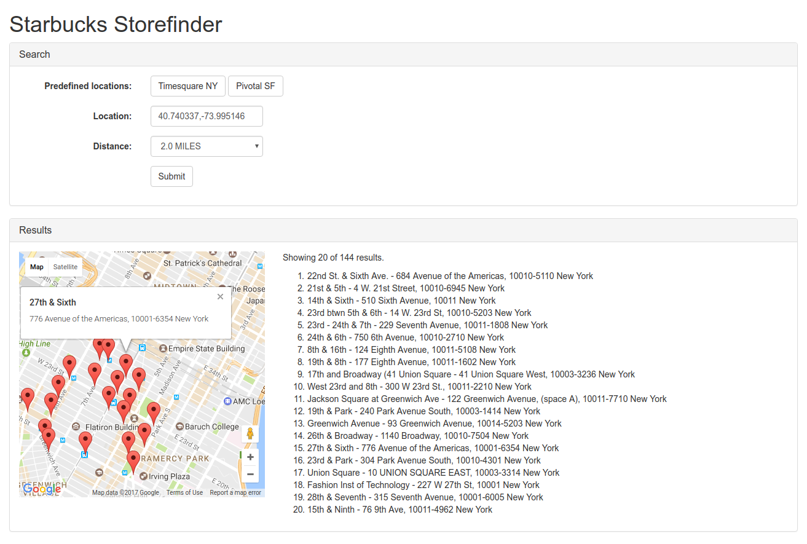

# Spring Data REST - Starbucks example

This sample app exposes 10843 Starbucks coffee shops via a RESTful API that allows to access the stores in a hypermedia based way and exposes a resource to execute geo-location search for coffee shops.

## Quickstart

1. Install MongoDB (http://www.mongodb.org/downloads, unzip, run `mkdir data`, run `bin/mongod --dbpath=data`)
2. Build and run the app (`mvn spring-boot:run`)
3. Access the location search directly (e.g. `http://localhost:8080`)

## Web UI

The application provides a custom web UI using the exposed REST API to display the search result on a Google Map. Point you browser to `http://localhost:8080`. The UI is rendered using Thymeleaf. A tiny JavaScript progressively enhances the view by picking up and enhancing a URI template rendered into the view (`
`).

 
## Technologies used

- Spring Data REST & Spring Data MongoDB
- MongoDB
- Spring Batch (to read the CSV file containing the store data and pipe it into MongoDB)
- Spring Boot
